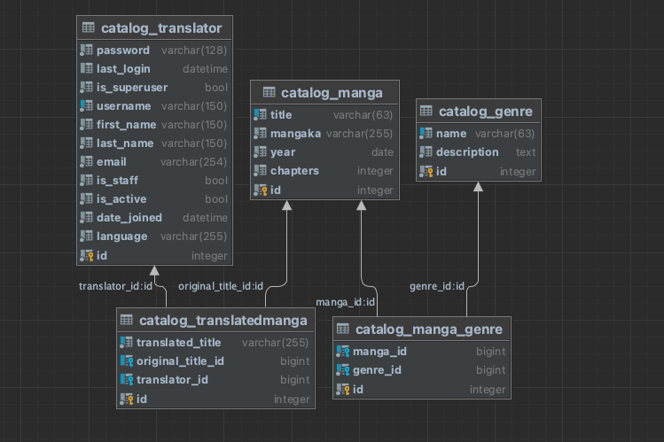
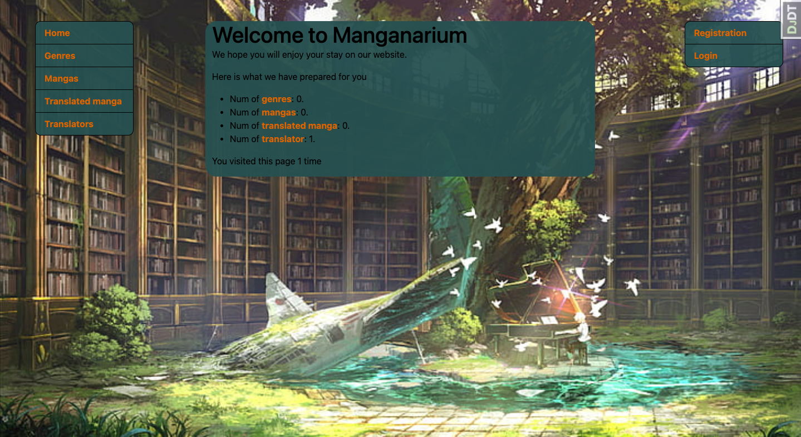

# Manganarium!

Django project for managing original and translated into another languages mangas by translators.


## Check it out!

[Manganarium project deployed to ###]

## Installation

Python3 must be already installed

```shell
git clone https://github.com/zhulich/manganarium
cd manganarium
python3 -m venv venv
source venv/bin/activate
pip install -r requirements.txt
python manage.py runserver # start Django server
```

## Features

* Authentication functionality for Translator/User
* Making genres, mangas, translators and translated manga directly from website interface
* Powerful admin panel for advanced managing

##Demo

